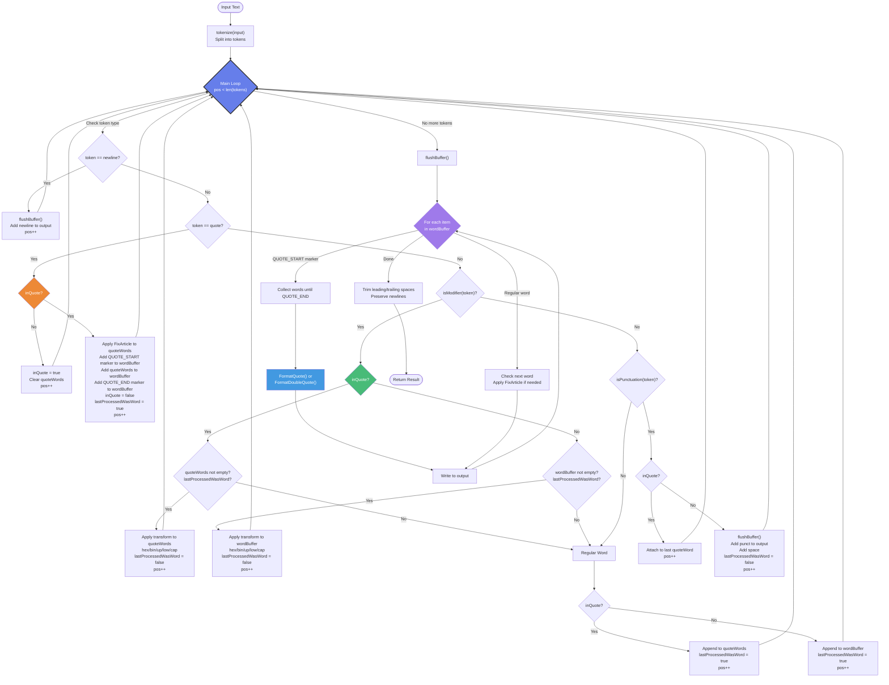

# Go-Reloaded Architecture Diagram

## FSM-Orchestrated Pipeline Architecture



## Architecture Components

### 1. **FSM Controller** (`fsm/processor.go`)
- **Role**: Orchestration and state management
- **States**: 
  - `inQuote` - tracking quote context
  - `lastProcessedWasWord` - modifier eligibility
  - `isDoubleQuote` - quote type preservation
- **Responsibilities**:
  - Token routing
  - State transitions
  - Context tracking
  - Buffer management

### 2. **Transformation Pipeline** (`transforms/`)
- **Role**: Stateless, pure transformation functions
- **Modules**:
  - `numbers.go` - Base conversions (hex, bin → decimal)
  - `cases.go` - Case transformations (up, low, cap)
  - `article.go` - Grammar correction (a → an)
- **Characteristics**:
  - Pure functions (no side effects)
  - Reusable and testable
  - Independent of FSM

### 3. **Formatting Pipeline** (`formatters/`)
- **Role**: Output formatting
- **Modules**:
  - `quotes.go` - Quote wrapping and spacing
  - `punctuation.go` - Punctuation spacing rules
- **Characteristics**:
  - Pure functions
  - Handles presentation logic

### 4. **Buffers** (State Storage)
- **wordBuffer**: Accumulates words between boundaries
- **quoteWords**: Isolated context for quoted text
- **output**: Final result builder

## Verified Test Traces

### Test 1: Simple Modifier
**Input:** `word (up)`

```
1. tokenize → ["word", "(up)"]
2. token="word" → Regular word → inQuote? No → wordBuffer=["word"], lastProcessedWasWord=true, pos++
3. token="(up)" → isModifier? Yes → inQuote? No → wordBuffer not empty? Yes, lastProcessedWasWord? Yes
   → Apply ToUpper → wordBuffer=["WORD"], lastProcessedWasWord=false, pos++
4. No more tokens → flushBuffer() → Write "WORD" to output
5. Result: "WORD" ✓
```

### Test 2: Quote with Modifier  
**Input:** `' hello world ' (up)`

```
1. tokenize → ["'", "hello", "world", "'", "(up)"]
2. token="'" → isQuote? Yes → inQuote? No → inQuote=true, pos++
3. token="hello" → Regular word → inQuote? Yes → quoteWords=["hello"], lastProcessedWasWord=true, pos++
4. token="world" → Regular word → inQuote? Yes → quoteWords=["hello","world"], lastProcessedWasWord=true, pos++
5. token="'" → isQuote? Yes → inQuote? Yes → Apply FixArticle to quoteWords
   → Add markers: wordBuffer=["'QUOTE_START'","hello","world","'QUOTE_END'"], inQuote=false, lastProcessedWasWord=true, pos++
6. token="(up)" → isModifier? Yes → inQuote? No → wordBuffer not empty? Yes, lastProcessedWasWord? Yes
   → Apply ToUpper to last 1 word (skipping markers) → wordBuffer=["'QUOTE_START'","hello","WORLD","'QUOTE_END'"], pos++
7. No more tokens → flushBuffer() → Format quote with ["hello","WORLD"] → Write "'hello WORLD'" to output
8. Result: "'hello WORLD'" ✓ (Note: only last word uppercased, not both)
```

### Test 3: Punctuation Boundary
**Input:** `one two, three (up)`

```
1. tokenize → ["one", "two", ",", "three", "(up)"]
2. token="one" → wordBuffer=["one"], lastProcessedWasWord=true, pos++
3. token="two" → wordBuffer=["one","two"], lastProcessedWasWord=true, pos++
4. token="," → isPunctuation? Yes → inQuote? No → flushBuffer() → Write "one two" to output
   → Add "," to output, lastProcessedWasWord=false, pos++
5. token="three" → wordBuffer=["three"], lastProcessedWasWord=true, pos++
6. token="(up)" → Apply ToUpper → wordBuffer=["THREE"], pos++
7. No more tokens → flushBuffer() → Write "THREE" to output
8. Result: "one two, THREE" ✓
```

### Test 4: Batch Modifier
**Input:** `one two three (up, 2)`

```
1. tokenize → ["one", "two", "three", "(up, 2)"]
2. token="one" → wordBuffer=["one"], pos++
3. token="two" → wordBuffer=["one","two"], pos++
4. token="three" → wordBuffer=["one","two","three"], lastProcessedWasWord=true, pos++
5. token="(up, 2)" → Apply ToUpper to last 2 words → wordBuffer=["one","TWO","THREE"], pos++
6. flushBuffer() → Write "one TWO THREE"
7. Result: "one TWO THREE" ✓
```

### Test 5: Article Correction
**Input:** `a apple a book`

```
1. tokenize → ["a", "apple", "a", "book"]
2. token="a" → wordBuffer=["a"], pos++
3. token="apple" → wordBuffer=["a","apple"], pos++
4. token="a" → wordBuffer=["a","apple","a"], pos++
5. token="book" → wordBuffer=["a","apple","a","book"], pos++
6. flushBuffer() → For each word:
   - "a" → next="apple" → FixArticle → "an" → Write "an"
   - "apple" → Write "apple"
   - "a" → next="book" → FixArticle → "a" (no change) → Write "a"
   - "book" → Write "book"
7. Result: "an apple a book" ✓
```

## Key Design Decisions

### Hybrid Architecture Benefits:
1. **FSM Strengths**: Context awareness, single-pass processing
2. **Pipeline Strengths**: Modularity, testability, reusability
3. **Best of Both**: Intelligent control + clean separation

### Punctuation as Boundaries:
- Semantic meaning: `. , ! ? : ;` end contexts
- Modifiers only affect current buffer
- Natural language intuition

### Quote Handling:
- Isolated context (separate buffer)
- Type preservation (single vs double)
- Modifiers can affect quoted text

## Performance Characteristics

- **Time Complexity**: O(n) - single pass
- **Space Complexity**: O(k) - buffer size (k << n)
- **Memory Efficient**: No full text copies
- **Scalable**: Handles large files efficiently
